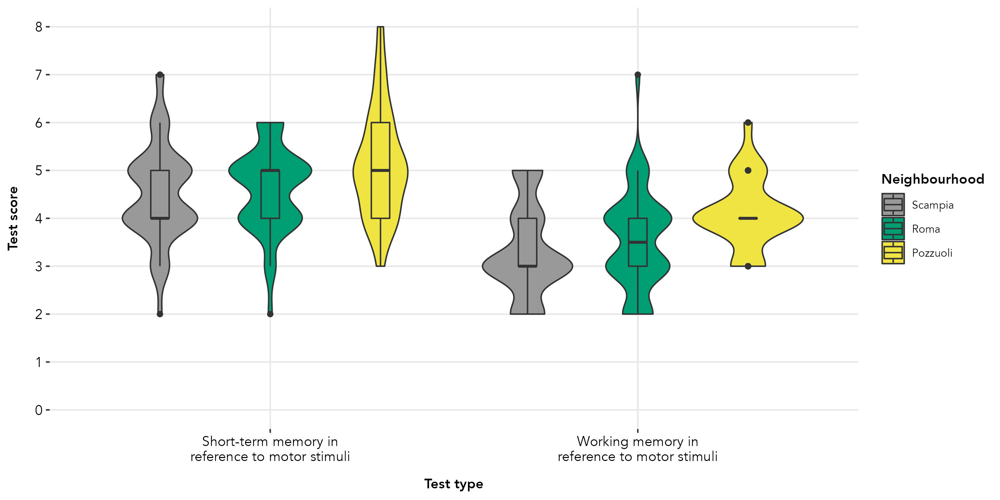
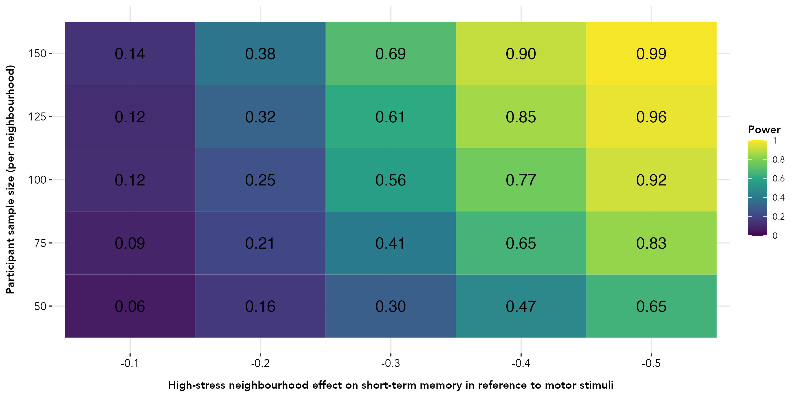
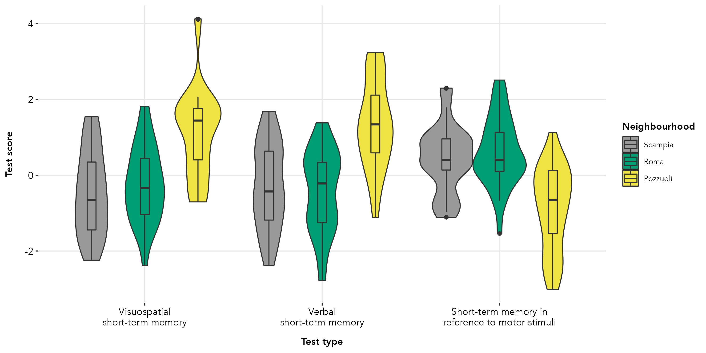
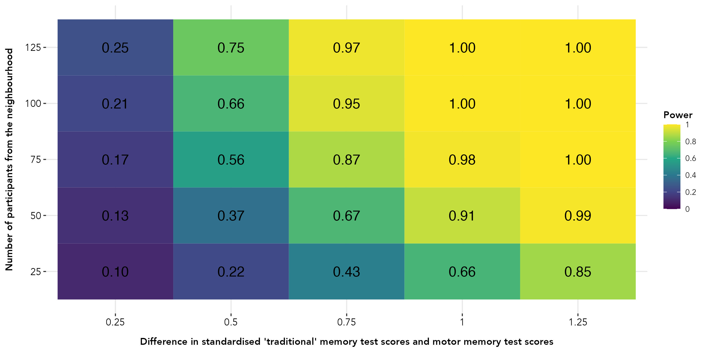

```{r setup, include=FALSE}
knitr::opts_chunk$set(echo = TRUE)

library(extrafont)
library(faux)
library(dplyr)
library(lme4)
library(lmerTest)
library(ggplot2)
library(tidyr)
library(broom.mixed)
library(purrr)
library(reshape2)
library(data.table)
library(tinytex)

### GRAPH THEMES ###

#fonts
quartzFonts(avenir = c("Avenir Book", "Avenir Black", "Avenir Book Oblique", "Avenir Black Oblique"))

#theme
header_size = 10
axis_size = 10

#theme for plots
avenir_theme = theme(text=element_text(size=header_size,family='avenir'),
                     axis.text.x = element_text(color = 'black', size = axis_size, vjust = 1),
                     axis.text.y = element_text(color = 'black', size = axis_size),
                     axis.title.y = element_text(margin = margin(t = 0, r = 10, b = 0, l = 0), face = "bold"),
                     axis.title.x = element_text(margin = margin(t = 10, r = 10, b = 0, l = 0), face = "bold"),
                     panel.background = element_blank(),
                     panel.grid.major.x = element_line(color = '#e7e7e7'),
                     panel.grid.major.y = element_line(color = '#e7e7e7'),
                     legend.key = element_blank(),
                     legend.title = element_text(color = 'black', size = axis_size, face = "bold"),
                     plot.title = element_text(hjust = 0.5, face = "bold"))

#set the font
par(family = 'avenir')

```

#### Gabriele Paone, Arran J. Davis, Emma Cohen
##### Institute of Human Sciences, University of Oxford
##### arran.davis@anthro.ox.ac.uk | davis.arran@gmail.com
##### 22 November 2022

## Introduction
Recent research has suggested the existence of a memory system dedicated to the storage and manipulation of information relating to body movements ('motor memory'). This study explores if populations of children from three environments in Napoli, Italy with dissimilar stress levels will score differently on short-term and working memory tasks that provide motor stimuli. There are two higher-stress environments (Scampia and a Roma camp) and one lower-stress environment (Pozzuoli).

We will test for differences between the three populations on scores for both motor memory tasks. We will also test whether any of the populations perform relatively better on the short-term and working memory tests for motor tasks than they do on ‘traditional’ tests of visuospatial and verbal short-term and working memory. These test scores will come from a previous study on these populations (AsPredicted #: 105025).

## Test for differences between test scores for the three populations

### Data simulation
The dependent (outcome) variables are performance in two tasks measuring: (1) short-term memory in reference to motor stimuli, and (2) working memory in reference to motor stimuli.

The study will include participants from three different environments in the greater metropolitan area of Napoli, Italy: one group from the Scampia neighbourhood (higher-stress), a second one from a Roma camp in the same metropolitan area (higher-stress), and a third one from the city of Pozzuoli (lower-stress).

Here, we assume that the effects on the outcome variables of each higher-stress environment will be the same (relative to the lower-stress environment).

To estimate motor short-term memory scores for this study, we used as a reference the means and standard deviations for verbal short-term memory (_M_ = 4.9, _SD_ = 1) found with the PML-2 battery test (D’Amico & Lipari, 2020), as our motor short-term memory tests followed the PML-2 battery test methods, except using motor stimuli (body movements). For each population, we assumed that motor working memory scores would be one point less than they were for motor short-term memory (this was based on piloting). 

For this particular data simulation, we assumed an effect of -0.4 of higher-stress environments on both outcome variables (i.e., that the Roma camp and Scampia population means would be 0.4 lower than the Pozzuoli population mean). We assumed standard deviations of 1 for all outcomes in all populations.

Assuming the above, and an overall mean score of 4.9 (D’Amico & Lipari, 2020) on the motor short-term memory test, we created the following distributions for each population and outcome variable:

* Roma camp and Scampia scores on motor short-term memory: _M_ = 4.75 (_SD_ = 1)
* Pozzuoli scores on motor short-term memory: _M_ = 5.15 (_SD_ = 1)

* Roma camp and Scampia scores on motor working memory: _M_ = 3.75 (_SD_ = 1)
* Pozzuoli scores on motor short-term memory: _M_ = 4.15 (_SD_ = 1)

This led to the following data simulation. 

``` {r data simulation, out.width="100%", echo=FALSE}

### CREATE DATA ###

#create the neighbourhood variable 
between = list(neighbourhood = c(Scampia = "Scampia", 
                                 Roma = "Roma camp",
                                 Pozzuoli = "Pozzuoli "))

#create the test variable
within = list(test = c("Short-term memory in reference to motor stimuli",
                       "Working memory in reference to motor stimuli"))

within_short = list(test = c("motor-short-term",
                             "motor-working"))

#create scores for each neighbourhood for short-term memory in reference to motor stimuli
scampia_motor_stm = 4.65
roma_motor_stm = 4.65
pozzuoli_motor_stm = 5.15

#create scores for each neighbourhood for working memory in reference to motor stimuli
scampia_motor_wm = 3.65
roma_motor_wm = 3.65
pozzuoli_motor_wm = 4.15

#create the mean scores for each neighbourhood on each memory test 
hood_means = list(Scampia = c(motor_stm = scampia_motor_stm, 
                              motor_wm = scampia_motor_wm),
                  Roma = c(motor_stm = roma_motor_stm,
                           motor_wm = roma_motor_wm),
                  Pozzuoli = c(motor_stm = pozzuoli_motor_stm,
                               motor_wm = pozzuoli_motor_wm))

#create the standard deviation scores for each neighbourhood on each memory test 
hood_sds = list(Scampia = c(motor_stm = 1, 
                            motor_wm = 1),
                Roma = c(motor_stm = 1,
                         motor_wm = 1),
                Pozzuoli = c(motor_stm = 1,
                             motor_wm = 1))

#set the correlation of test score results for each neighbourhood
hood_cors = list(Scampia = .6, Roma = .6, Pozzuoli = .7)

#create the dataframe
dat = sim_design(within_short, between, n = 50, 
                 mu = hood_means, sd = hood_sds, r = hood_cors,
                 empirical = FALSE, plot = FALSE)

#make the data long format
dat_long = melt(setDT(dat), id.vars = c("id","neighbourhood"), variable.name = "test")

#ensure no values are below 2 or above 8
dat_long$value = ifelse(dat_long$value < 2, 2,
                        ifelse(dat_long$value > 8, 8, dat_long$value))

#set contrasts of neighbourhood so that "Pozzuoli" is the reference
contrasts(dat_long$neighbourhood) = contr.treatment(3, base = 3)

#round the test scores to a whole number
dat_long$value = round(dat_long$value, 0)

### ### ###

#load plot themes
source("plot_theme.R")

#show code for plotting the data (final JPG file loaded into PDF)
test_labels = c("Short-term memory in\nreference to motor stimuli",
                "Working memory in\nreference to motor stimuli")

hood_colors = c("#999999", "#009E73", "#F0E442")

scores_by_hood = ggplot(dat_long, aes(x = test, y = value)) + 
                  geom_violin(aes(fill = neighbourhood), trim = TRUE, position = position_dodge(0.9)) +
                  geom_boxplot(aes(fill = neighbourhood), width = 0.15, position = position_dodge(0.9)) +
                  scale_x_discrete(labels = test_labels) +
                  scale_y_continuous(limits = c(0,8), breaks = c(seq(0,8,1))) +
                  scale_fill_manual(values = hood_colors) +
                  ylab("Test score") +
                  xlab("Test type") +
                  labs(fill = "Neighbourhood") +
                  aes(ymin = 0) 

```


```{r plotted simulated data, echo=FALSE, fig.cap="", out.width = '100%'}

```

### Power analyses 

Power analyses were carried out using the `faux` package in R (DeBruine, 2021). Using the dataset described above as a reference, 2,500 simulated sample datasets were created for the short-term motor memory test This was done through sampling different simulated populations of test scores (`test_score`) that varied according to neighbourhood (`environment`) sample size (50, 75, 100, 125, 150) and the effect of the higher-stress environment on test scores (-0.1, -0.2, -0.3, -0.4, -0.5).

The following model was run on the 2,500 simulated sample datasets; treatment contrasts where used for the `environment` variable, with the lower-stress population (Pozzuoli) being the baseline or reference category.

```
lm(test_score ~ environment, data = data)
```

The power analyses reported below were calculated as the frequency of the 2,500 _p_-values that were less than 0.05 for the _b_-coefficient that compared the Roma camp to Pozzuoli (the effects of both higher-stress environments were assumed to be the same, so only one comparison was necessary).


```{r load and process power analysis data, fig.show="hold", echo=FALSE}

#load the simulation data
simulations = read.csv("../data/study3_motor_memory_data_simulations.csv")

#subset the data to each outcome type
stm_sims = subset(simulations, simulations$outcome == "Short-term memory in reference to motor stimuli")
wm_sims = subset(simulations, simulations$outcome == "Working memory in reference to motor stimuli")

#create dataset to plot power analysis for neighbourhood main effects (both high-stress neighbourhoods were estimated to have the same effect)
simulation_results_neighbourhood_stm = filter(stm_sims, term == "neighbourhood1") %>%
                                            group_by(high_stress_motor_effect, participant_n) %>% 
                                            summarise(power = mean(p.value < .05), .groups = "drop")


simulation_results_neighbourhood_wm = filter(wm_sims, term == "neighbourhood1") %>%
                                           group_by(high_stress_motor_effect, participant_n) %>% 
                                           summarise(power = mean(p.value < .05), .groups = "drop")

### ### ###

#show code for plotting power analyse for neighbourhood effect on motor short-term memory (final JPG file loaded into PDF))
stm_pa = ggplot(aes(as.character(high_stress_motor_effect), participant_n, fill = power), 
                data = simulation_results_neighbourhood_stm) +
          geom_tile() +
          geom_text(aes(label = sprintf("%.2f", power)), color = "black", size = 5) +
          scale_y_continuous(breaks = c(50, 75, 100, 125, 150)) +
          scale_fill_viridis_c(name = "Power",
                               limits = c(0, 1), 
                               breaks = c(0, 0.2, 0.4, 0.6, 0.8, 1),
                               labels = c(0, 0.2, 0.4, 0.6, 0.8, 1)) +
          xlab("High-stress neighbourhood effect on short-term motor memory") + 
          ylab("Participant sample size (per neighbourhood)") 

```

```{r plotted power analyses, echo=FALSE, fig.cap="", out.width = '100%'}

```

Above is the power analysis result with short-term motor memory as the outcome. Results suggest that 125 participants per neighbourhood would give sufficient power (0.85) to detect mean differences of at least 0.4 between the higher-stress and lower-stress neighbourhoods.

## Test for whether any of the populations perform differently on motor memory tasks versus ‘traditional’ memory tasks

### Data simulation

We will also test whether the populations perform differently on the short-term and working memory tests for motor tasks than they do on 'traditional' (1) visuospatial and (2) verbal short-term and working memory tests. To do this, we will use visuospatial and verbal short-term and working memory test scores from a previous study on these populations (AsPredicted #: 105025). Specifically, we will use multilevel linear models to test whether standardised short-term and working memory test scores for motor tasks differ from standardised 'traditional' visuospatial and verbal short-term and working memory test scores within each population.

For this data simulation and power analyses, we assumed a different scenario than the one used in the data simulation and power analyses described above. In this scenario, we assumed that the there would be a difference of 0.75 in standardised scores between the lower-stress and higher-stress neighbourhoods for the 'traditional' and motor memory tests. Specifically, we assumed that the higher-stress neighbourhoods (the Roma camp and Scampia) would have standardised scores that are 0.75 less than the lower-stress neighbourhood (Pozzuoli) for the 'traditional' memory tests, and standardised scores 0.75 higher than Pozzuoli for the motor memory tests.

Test scores were assumed to come from the same participant, making this a within-subjects design with three test scores per participant: (1) visuospatial, (2) verbal, and (3) motor memory. This is also true for the data simulations used in the below power analyses.

Assuming the above, we created the following distributions of standardised scores for each population for the short-term 'traditional' and motor memory tests:

* Roma camp and Scampia standardised scores on 'traditional' short-term memory tests: _M_ = -0.25 (_SD_ = 1)
* Pozzuoli standardised scores on 'traditional' short-term memory tests: _M_ = 0.5 (_SD_ = 1)

* Roma camp and Scampia standardised scores on short-term motor memory test: _M_ = 0.25 (_SD_ = 1)
* Pozzuoli standardised scores on short-term motor memory test: _M_ = -0.5 (_SD_ = 1)

``` {r data simulation for comparison with previous study, out.width="100%", echo=FALSE}

### COMPARISON WITH STUDY 1 TEST SCORES (RELATIVE CHANGE) - EXAMPLE DATA ###

#set difference scores, standard deviations, and correlations
high_stress_difference_standard = -0.75
high_stress_difference_motor = 0.75
sd = 1
test_score_cors_pozzuoli = 0.7
test_score_cors_high_stress = 0.6

#get high and low stress neighbourhood means for both test types
high_stress_standard_mean = high_stress_difference_standard / 3
low_stress_standard_mean = high_stress_standard_mean - high_stress_difference_standard

high_stress_motor_mean = high_stress_difference_motor / 3
low_stress_motor_mean = high_stress_motor_mean - high_stress_difference_motor  

#set expected means and SDs (data will be scaled within test type) for each group and test
pozzuoli_standard_mean = low_stress_standard_mean
pozzuoli_standard_sd = sd
roma_standard_mean = high_stress_standard_mean
roma_standard_sd = sd
scampia_standard_mean = high_stress_standard_mean
scampia_standard_sd = sd

pozzuoli_motor_mean = low_stress_motor_mean
pozzuoli_motor_sd = sd
roma_motor_mean = high_stress_motor_mean
roma_motor_sd = sd
scampia_motor_mean = high_stress_motor_mean
scampia_motor_sd = sd

#create a dataframe of just 20 participants, some with two and one measures (for illustrative purposes)
data = data.frame(test_score = c(rnorm(20, pozzuoli_standard_mean, pozzuoli_standard_sd),
                                 rnorm(19, roma_standard_mean, roma_standard_sd),
                                 rnorm(18, scampia_standard_mean, scampia_standard_sd),
                                 rnorm(20, pozzuoli_standard_mean, pozzuoli_standard_sd),
                                 rnorm(19, roma_standard_mean, roma_standard_sd),
                                 rnorm(18, scampia_standard_mean, scampia_standard_sd),
                                 rnorm(17, pozzuoli_motor_mean, pozzuoli_motor_sd),
                                 rnorm(18, roma_motor_mean, roma_motor_sd),
                                 rnorm(16, scampia_motor_mean, scampia_motor_sd)),
                  test_type = c(rep("visuospatial", 20),
                                rep("visuospatial", 19),
                                rep("visuospatial", 18),
                                rep("verbal", 20),
                                rep("verbal", 19),
                                rep("verbal", 18),
                                rep("motor", 17),
                                rep("motor", 18),
                                rep("motor", 16)),
                  hood =  c(rep("Pozzuoli", 20),
                            rep("Roma", 19),
                            rep("Scampia", 18),
                            rep("Pozzuoli", 20),
                            rep("Roma", 19),
                            rep("Scampia", 18),
                            rep("Pozzuoli", 17),
                            rep("Roma", 18),
                            rep("Scampia", 16)),
                  participant_id = c(seq(1, 20, 1),
                                     seq(21, 24, 1), seq(26, 40, 1),
                                     41, 42, 43, seq(45, 56, 1), 58, 59, 60,
                                     seq(1, 20, 1),
                                     seq(21, 24, 1), seq(26, 40, 1),
                                     41, 42, 43, seq(45, 56, 1), 58, 59, 60,
                                     seq(1, 7, 1), seq(9, 13, 1), seq(15, 19, 1),
                                     21, 22, seq(24, 37, 1), 39, 40,
                                     42, 44, seq(45, 53, 1), 55, 56, 57, 59, 60)) 

#make relevant variables factors
data$hood = factor(data$hood, levels = c("Scampia", "Roma", "Pozzuoli"))
data$test_type = factor(data$test_type, levels = c("visuospatial", "verbal", "motor"))

#run the model (first set contrasts)
contrasts(data$hood) = contr.treatment(3, base = 3)
contrasts(data$test_type) = contr.treatment(3, base = 1)
comparison_model = lmer(test_score ~ hood*test_type + (1 | participant_id), data = data,
                        control=lmerControl(check.conv.singular = .makeCC(action = "ignore",  tol = 1e-4)))

### ### ###

#show code for plotting the data (final JPG file loaded into PDF)
scores_by_hood_and_test = ggplot(data, aes(x = test_type, y = test_score)) + 
                            geom_violin(aes(fill = hood), trim = TRUE, position = position_dodge(0.9)) +
                            geom_boxplot(aes(fill = hood), width = 0.15, position = position_dodge(0.9)) +
                            scale_fill_manual(values = hood_colors) +
                            scale_x_discrete(labels = c("Visuospatial\nshort-term memory",
                                                        "Verbal\nshort-term memory",
                                                        "Short-term memory in\nreference to motor stimuli")) +
                            ylab("Test score") +
                            xlab("Test type") +
                            labs(fill = "Neighbourhood") +
                            aes(ymin = 0) 

```


```{r plotted data simulation for comparison with previous study, echo=FALSE, fig.cap="", out.width = '100%'}

```

### Power analyses 

Power analyses were carried out using the `faux` (DeBruine, 2021) and `lmer` (Bates et al., 2014) packages in R. Using the dataset described above as a reference, 25,000 simulated sample datasets were created to compare potential distributions for the two types of short-term memory test scores across the neighbourhoods. This was done through sampling different simulated populations of test scores (`test_score`) that varied according to neighbourhood (`environment`) sample size (25, 50, 75, 100, 125) and the difference between standardised scores for the 'traditional' and motor test types: (1.25, 1, 0.75, 0.5, 0.25). The higher-stress neighbourhoods were set to have lower standardised scores for the 'traditional' memory tests and higher standardised scores for the motor memory test.

The following model was run on each of the 1,000 simulated sample datasets for each of the 25 potential `test_score` by `environment` combinations (25,000 in total). Treatment contrasts where used for the `environment` variable, with the lower-stress population (Pozzuoli) being the baseline or reference category, and for the `test_type` variable, with the 'traditional' visuospatial memory test being the baseline or reference category.

```
comparison_model = lmer(test_score ~ environment * test_type + (1 | participant_id), data = data)
```

We then estimated marginal means for _post hoc_ analyses of the `environment * test_type` interaction using the _emmeans_ package in R (Lenth et al., 2018). 

```
emmeans(comparison_model, data = data, pairwise ~ test_type | environment)

```

For this power analysis, we focused on marginal mean differences in standardised scores for the 'traditional' visuospatial memory test and the motor memory test in higher-stress environments (the data simulation used the same parameters for both the Roma camp and Scampia neighbourhood).  

The power analyses reported below were calculated as the frequency of the 1,000 _p_-values that were less than 0.05 for the _t_-ratio comparing standardised test scores for 'traditional' visuospatial short-term memory with standardised test scores for short-term motor memory for the Scampia neighbourhood (the effects of both higher-stress environments were assumed to be the same, so we only report the Scampia comparisons here). This was done for each of the 25 potential `test_score` and `environment` combinations.

```{r load and process power analysis data for comparison with previous study, fig.show="hold", echo=FALSE}

#load the simulation data
simulations = read.csv("../data/study3_motor_and_standard_memory_comparisons_data_simulations.csv")

#create dataset to plot power analysis (both high-stress neighbourhoods were estimated to have the same effect)
simulation_results_roma = filter(simulations, hood == "Scampia") %>%
                                    group_by(difference_between_hoods, participant_n) %>% 
                                    summarise(power = mean(p.value < .05), .groups = "drop")

### ### ###

#show code for plotting power analysis for test score differences for the Scampia neighbourhood (final JPG file loaded into PDF)
stm_comp_pa = ggplot(aes(as.character(difference_between_hoods), participant_n, fill = power), 
                     data = simulation_results_roma) +
                geom_tile() +
                geom_text(aes(label = sprintf("%.2f", power)), color = "black", size = 5) +
                scale_y_continuous(breaks = c(25, 50, 75, 100, 125, 150)) +
                scale_fill_viridis_c(name = "Power",
                                     limits = c(0, 1), 
                                     breaks = c(0, 0.2, 0.4, 0.6, 0.8, 1),
                                     labels = c(0, 0.2, 0.4, 0.6, 0.8, 1)) +
                xlab("Difference in standardised 'traditional' memory test scores and motor memory test scores") + 
                ylab("Number of participants from the neighbourhood") 

```

```{r plotted power analyses for comparison with previous study, echo=FALSE, fig.cap="", out.width = '100%'}

```

Above is the power analysis for comparing differences in standardised 'traditional' memory test scores and standardised motor memory test scores for a higher-stress neighbourhood (Scampia). Results suggest that a sample size of at least 75 participants is needed to detect a difference 0.75 in standardised scores between the two test types.

## Citations

Bates, D., Maechler M., Bolker, B., Walker, S. (2014). _lme4: linear mixed-effects models using Eigen and S4_, R. package version 1.1.30. https://github.com/lme4/lme4/.

DeBruine, L. (2021). _faux: Simulation for Factorial Designs_. doi: 10.5281/zenodo.2669586, R package version 1.1.0, https://debruine.github.io/faux/. 

D'Amico, A., & Lipari, C. (2020). _PML-2. Prove per la misurazione della memoria di lavoro_. Galton.

Lenth, R., Love, J., Hervé, M. (2018). _Package emmeans_. R package version 1.7.4.1, https://github.com/rvlenth/emmeans.